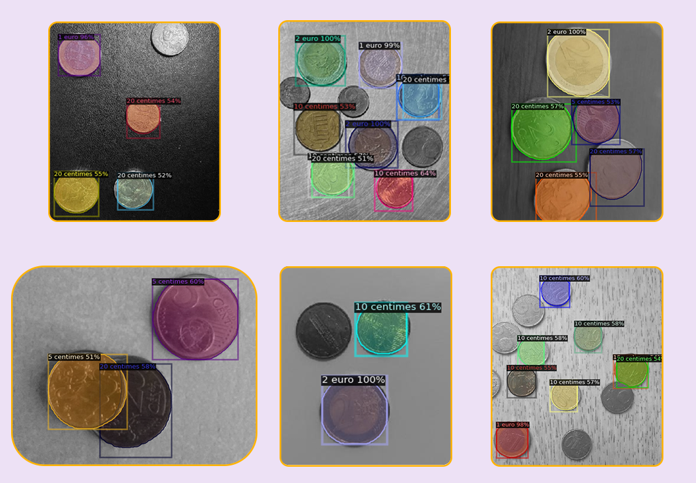

# Instance Segmentation Euro Coins

## Traitement d'images

Commencez par installer les dependances : `pip install matplotlib numpy opencv-python` ou `pip install -r requirements.txt`.

Afin de lancer la detection / segmentation des pièces et tester différents seuils en temps réel, décommentez la ligne `#main_detect()` dans le fichier detection.py, changer la ligne `edge = cv2.Canny(gray, lower, upper+60)` par `edge = cv2.Canny(gray, thresh1, thresh2)` et lancez la commande `python detection.py`

Si vous souhaitez visualiser le processus d'identification des pièces, décommentez la ligne `#main_anotate()` dans annotate.py, assurez vous de commenter la ligne `#main_detect()` dans le fichier detection.py et lancez la commande `python annotate.py`.

Pour lancer le programme en entier incluant detection, annotation et evaluation (metrics), ouvrez le fichier input/labels/\_annotations.csv, copiez toutes les lignes correspondant aux images que vous voulez tester (chaque ligne commence par le nom du fichier image et chaque image a autant de lignes qu'elle contient de pièces), collez ces lignes dans le fichier input/tests/\_annotations.csv. Assurez que les lignes soient triées dans l'ordre alpha-numérique afin que le calcul de la mAP se fasse dans le meme ordre que la detection et l'annotation des pieces (autrement la mAP sera systematiquement 0). Copiez toutes les images correspondant aux lignes que vous avez copiées plutot et collez les images dans input/tests. Les noms de fichier n'ont pas d'importance. Commentez les lignes `#main_detect()` et `#main_anotate()` et lancer la commande `python main.py`. Le programme a 2 moyens de réaliser la détection / segmentation : filtre de Canny ou transformée de Hough (par défault). Si vous souhaitez utiliser Canny, décommentez la ligne 23 du fichier main.py `#dilate, canny, cannyBbox = canny_cv(image)`, commentez la ligne suivante et remplacez l'argument houghBbox par cannyBbox à la ligne 32. Notez que la mAP affichée est considérablement réduite à cause des classes verso-bronze et verso-or que nous avons finalement décidé d'ignorer étant donné que notre algorithme est basé sur la couleur des bords, différence de saturation et ratio de diamètre des pièces. Les pièces versos sont identifiés correctement avec leur valeur au même titre et niveau que les pièces rectos mais ont tout de même une mAP nulle, faute de ne pas avoir eu le temps de leur réassigner d'autres classes sur Roboflow.

## YOLOV8

### Entrainer

Pour entrainer à nouveau le model, copier le dossier yolov8 dans votre google drive, modifier le fichier `data/penny.yaml` en spécifiant le chemin absolu du jeu d'entrainement, ouvrir le notebook `yolov8.ipynb` avec Google Colab et lancer chaque cellule.

### Prédire

Pour utiliser notre model entrainé, ouvrez le script `segmentation.py`, créez et activez un environnement avec conda ou venv selon votre convenience, installez ultralytics avec la commande `pip install ultralytics`, lancez le programme.

## Detectron2

Copier ce dossier Detectron2 dans un dossier Google Colab de votre Google Drive, ouvez le notebook et lancez toutes les cellules à l'exception de l'entrainement si vous souhaitez utiliser notre model entrainé sur 5 epochs. 

